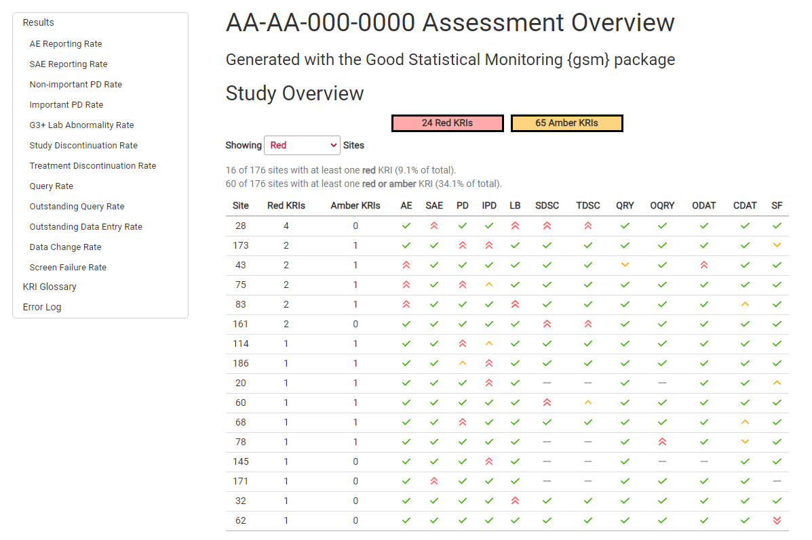

# gsm.reporting

<!-- badges: start -->
  [](https://github.com/Gilead-BioStats/gsm.reporting/actions/workflows/R-CMD-check.yaml)
<!-- badges: end -->

The {gsm} ecosystem provides a standardized Risk Based Quality Monitoring (RBQM) framework for clinical trials that pairs a flexible data pipeline with robust reports like the one shown below.  

<center> 
 


</center>


The `{gsm.reporting}` package provides the necessary functions and workflows to produce the reporting data model that is used byt many packages to produce visualizations and reports.
This README provides a high-level overview of {gsm.reporting}; see the [gsm Reporting Vignette](https://gilead-biostats.github.io/gsm.reporting/gsmReporting.html) for additional details.

With all necessary inputs to the reporting model created via functions in `{gsm.mapping}` and `{gsm.core}`, `{gsm.reporting}` generates the reporting data model data frames. These data frames created are as follows:

1. `dfGroups`: Group-level metadata dictionary. Created by passing CTMS site and study data to `MakeLongMeta()`.
2. `dfMetrics`: Metric-specific metadata for use in charts and reporting. Created by passing an `lWorkflow` object to `MakeMetric()`. 
3. `dfResults`: A stacked summary of analysis pipeline output. Created by passing a list of
 results returned by `Summarize()` to `BindResults()`.
4. `dfBounds`: Set of predicted percentages/rates and upper- and lower-bounds across the full range of sample sizes/total exposure values for reporting. Created by passing `dfResults` and `dfMetrics` to `MakeBounds()`. 


## Installation

You can install the development version of gsm.reporting like so:

``` r
# install.packages("pak")
pak::pak("Gilead-BioStats/gsm.reporting@dev")
```
